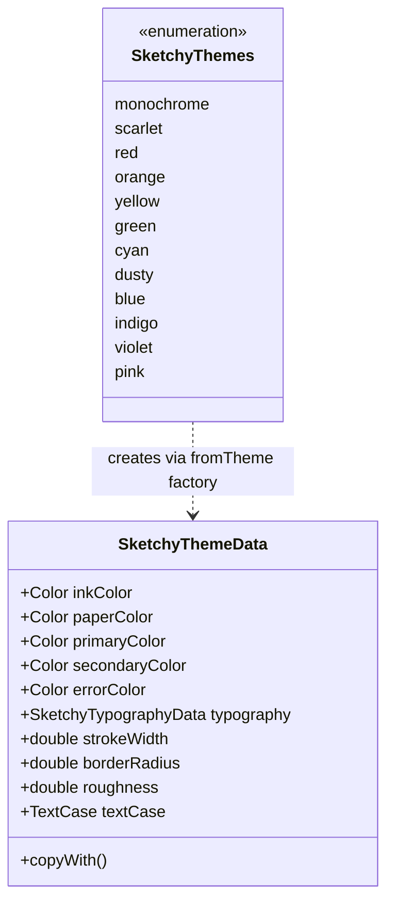

# Sketchy Design System (Flutter)

Sketchy is a hand-drawn, xkcd-inspired design language for Flutter mobile,
desktop, and web. It's powered by Sketchy primitives, the rough_flutter package,
and the Comic Shanns font.

---

## Design Principles

1. **Intentional roughness**  
   Straight lines are suspicious. Borders wobble and circles are lopsided on
   purpose. If you're gentle or performance-conscious, you can dial down the
   roughness to your preference.

2. **Clarity first**  
   Comic Shanns is fun but highly readable. Layout and hierarchy must stay clear
   even when the lines are messy. The example shows how to swap in the official
   xkcd or Excalifont fonts if you'd rather.

3. **Low-stakes visuals**  
   Sketchy should make designs feel approachable and changeable. Nothing looks
   “finished” enough to be sacred.

4. **Consistency under the chaos**  
   Behind the loose look is a consistent set of colors, styles and and widgets
   so the implementation stays solid. It may look rough, but each primitive gets
   its own seed so that it re-draws itself uniquely but consistently.

---

## Visual Language

### Typeface

- **Primary font:** `Comic Shanns` (from
  https://github.com/shannpersand/comic-shanns)  
- **Usage:**
  - Display / titles: larger sizes, bold
  - Body copy: regular weight, generous line height
  - Labels & captions: small but still comfortably readable

The entire app uses Comic Shanns via `ThemeData.fontFamily`.

---

### Color System

Sketchy defines a comprehensive set of themes, each with its own ink, paper, primary, and secondary colors.

*   **Ink**: The color used for text, borders, and outlines (primary content).
*   **Paper**: The background color, emulating the surface being drawn on.
*   **Primary**: The main accent color for highlights, active states, and key actions.
*   **Secondary**: A softer accent for fills, backgrounds, and secondary elements.
*   **Error**: A consistent error color (`Carmine`, #D64550) is used across all themes.

#### Theme Palette Table

| Theme          | Ink Name     | Ink Hex   | Paper Name | Paper Hex | Primary Name | Primary Hex | Secondary Name | Secondary Hex |
| :------------- | :----------- | :-------- | :--------- | :-------- | :----------- | :---------- | :------------- | :------------ |
| **monochrome** | Black        | `#000000` | White      | `#FFFFFF` | Black        | `#000000`   | White          | `#FFFFFF`     |
| **scarlet**    | Maroon       | `#5C1111` | Rose       | `#FFF1F7` | Dark Scarlet | `#981200`   | Rosewash       | `#E6B9B0`     |
| **red**        | Maroon       | `#5C1111` | Rose       | `#FFF1F7` | Red          | `#FF2500`   | Blush          | `#F5CCCC`     |
| **orange**     | Rust         | `#7A2F05` | Apricot    | `#FFF4E9` | Orange       | `#FF9A02`   | Creamsicle     | `#FCE5CC`     |
| **yellow**     | Ochre        | `#7C5B04` | Cream      | `#FFFBE6` | Yellow       | `#FFFB03`   | Buttercream    | `#FFF3CC`     |
| **green**      | Forest Green | `#184B2B` | Mint       | `#F1FFF4` | Green        | `#09F902`   | Mint Fade      | `#D9EAD3`     |
| **cyan**       | Deep Teal    | `#06464E` | Aqua       | `#F0FDFF` | Cyan         | `#0AFDFF`   | Ice Mist       | `#D0E1E3`     |
| **dusty**      | Navy         | `#0F305D` | Cloud      | `#F0F6FF` | Dusty        | `#4A86E8`   | Powder Blue    | `#C9DAF8`     |
| **blue**       | Navy         | `#0F305D` | Cloud      | `#F0F6FF` | Blue         | `#0133FF`   | Skywash        | `#D0E3F2`     |
| **indigo**     | Midnight     | `#261E61` | Lavender   | `#F4F0FF` | Indigo       | `#5C6BC0`   | Periwinkle     | `#D1C4E9`     |
| **violet**     | Plum         | `#3C164D` | Orchid     | `#FFF0FF` | Violet       | `#9938FF`   | Lavender Haze  | `#D9D1E9`     |
| **pink**       | Wine         | `#5A0E2A` | Rose       | `#FFF1F7` | Pink         | `#FF40FF`   | Petal Blush    | `#EAD1DC`     |

In **light mode**, the primary and secondary colors are used as defined above.  
In **dark mode**, the roles are swapped to maintain contrast and hierarchy:
*   **Ink** becomes **Paper** (and vice-versa).
*   **Primary** becomes **Secondary** (and vice-versa).

This inversion makes dark mode feel like the same world, just inverted (e.g., white chalk on a blackboard).

---

### Line Style & Shapes

The rough look is powered by `SketchyPrimitive`s backed by `rough_flutter`:

- Double-line, jittery rectangles and circles
- Slight randomness in stroke path
- Rectangular shapes that feel hand-drawn rather than geometric

**Flicker Control:** To prevent the "boiling" effect common in randomized rendering, Sketchy widgets cache their drawing seeds. This ensures that while every button looks unique, a single button doesn't jitter distractingly while it's being animated or interacted with.

Guidelines:

- Prefer the built-in Sketchy widgets for all visible UI.
- Keep layouts simple—too many outlined things crowded together becomes visually
  noisy.

---

## Modes & Themes

### Light Mode

- Background: Theme's **Paper** color.
- Foreground/Text: Theme's **Ink** color.
- Primary/Secondary: Used as defined in the palette.
- Shadows are minimal; hierarchy is driven mostly by layout, stroke, and color.

### Dark Mode

- Background: Theme's **Ink** color (swapped).
- Foreground/Text: Theme's **Paper** color (swapped).
- Primary/Secondary: Swapped (Primary becomes darker/softer, Secondary becomes brighter/bolder).
- Text uses light colors; outlines remain clearly visible.

Mode switching is exposed via Sketchy-styled toggle buttons: **Light** and
**Dark**.

---

## Flutter-Specific Implementation

In Flutter terms, Sketchy is a reusable **design system package** that apps
depend on.

It has three main layers:

1. **Theme layer** – `SketchyThemeData` and `SketchyThemes` presets
2. **Components layer** – `Sketchy*` widgets built from theme data and primitives
3. **Docs layer** – the in-app “Sketchy Design System” screen itself  

### Package & Folder Structure

Recommended layout:

```text
lib/
  sketchy.dart                     # public exports

  src/
    theme/
      sketchy_colors.dart          # static color palette
      sketchy_theme.dart           # theme data configuration
      sketchy_themes.dart          # preset themes and palette logic
      sketchy_typography.dart      # comic shanns text styles

    widgets/
      sketchy_button.dart
      sketchy_text_field.dart
      sketchy_divider.dart
      sketchy_radio.dart
      sketchy_slider.dart
      sketchy_linear_progress_indicator.dart
      sketchy_calendar.dart

    docs/
      sketchy_design_system_page.dart
````

* **Apps import `package:sketchy/sketchy.dart`** and stay unaware of the
  rendering primitives under the hood.

### Theme Configuration

`SketchyThemeData` holds the configuration for the design system:



`SketchyTheme` is an `InheritedWidget` that exposes `SketchyThemeData` to the widget tree.

Widgets read theme data by accessing the theme from the current context:

```dart
final theme = SketchyTheme.of(context);
```

This keeps **theme data as the single source of truth** for all Sketchy components.

### Sketchy Components as the Public API

Each public Sketchy widget is the canonical implementation and automatically
applies the active theme:

* `SketchyButton`
* `SketchyTextField`
* `SketchyDivider`
* `SketchyRadio<T>`
* `SketchyCheckbox`
* `SketchySwitch`
* `SketchySlider`
* `SketchyLinearProgressIndicator`
* `SketchyCalendar`
* `SketchyCard`
* `SketchyDialog`
* `SketchyChip`
* `SketchyTooltip`
* `SketchySnackBar`
* `SketchyAppBar`
* `SketchyScaffold`
* `SketchySymbol`

App code **never talks to internal primitives directly**; that lets Sketchy
evolve internals without breaking consumers.

### Docs as Part of the System

The **Sketchy Design System page** is a first-class artifact:

* Shows **all themes** (palettes, theme names, light/dark swap behavior).
* Shows **all components** in representative states with realistic content.
* Acts as a **storybook** for designers and engineers.

You can:

* Ship it as a separate `sketchy_docs` entrypoint, or
* Expose it behind a debug-only route in the consuming app.

### Testing & Governance

To keep Sketchy stable as it grows:

* Use **golden tests** for core Sketchy widgets to catch visual regressions.
* Add **widget tests** for theming behavior (e.g., verifying primary/secondary
  swap in dark mode).
* Version Sketchy as a standalone package; document:

  * Supported Flutter SDK versions
  * Breaking changes (theme shifts, widget API changes)
  * Deprecation paths for old widgets or props

---

## Component Library

All components share the same Sketchy primitives and are exposed as **Sketchy**
widgets.

### 1. Sketchy Buttons

**Base widget:** `SketchyButton`

Variants (examples):

* Primary Sketchy Button
* Secondary actions like **Submit**, **Cancel**
* Long-label buttons, e.g., `Long text button … hah`

Guidelines:

* Use short, conversational labels.
* Use layout and grouping to communicate importance (CTAs at the bottom or in
  consistent positions).

---

### 2. Sketchy Divider

**Base widget:** `SketchyDivider`

Used to:

* Separate paragraphs or sections of content
* Divide stacked blocks like cards or form sections

Typical layout:

* Heading (`Sketchy divider`)
* Paragraph of body text
* Divider
* Another paragraph

---

### 3. Sketchy Text Input

**Base widget:** `SketchyTextField`

Examples:

* **Name** – placeholder “Hello sketchy input”
* **User Email** – “Please enter user email”
* **Your age** – “Your age please!”

Guidelines:

* Use Comic Shanns labels outside the input; placeholders inside are light and
  friendly.
* Keep horizontal padding generous; the jittery border needs breathing room.

---

### 4. Sketchy Radio

**Base widget:** `SketchyRadio<T>`

Example options:

* `Lafayette`
* `Thomas Jefferson`

Guidelines:

* Best for small sets of mutually exclusive options.
* Keep labels concise, with at least `space.sm` between options vertically.

---

### 5. Sketchy Slider

**Base widget:** `SketchySlider`

Usage:

* Selecting approximate numeric values (e.g., percentage, volume, rating)

Guidelines:

* Always accompany with a live numeric or semantic label: `Value: 20` or `Loud`,
  `Normal`, etc.
* Prefer for “feel” adjustments, not exact numbers.

---

### 6. Sketchy Progress

**Base widget:** `SketchyLinearProgressIndicator`

Pattern:

* A progress bar showing completion fraction
* Control buttons: **Start**, **Stop**, **Reset**

Guidelines:

* Use for background operations or async tasks where feedback is helpful but not
  life-or-death.
* Avoid overly long animations—the scribbled fill is already visually busy.

---

### 7. Sketchy Calendar

**Base widget:** `SketchyCalendar`

Example:

* Month view for a given year, with the selected date scribble-circled.

Guidelines:

* Designed primarily for **single date selection**.
* Use Sketchy typography for month and weekday labels.
* Selected date should be clearly indicated but still feel hand-drawn.

### 8. Sketchy Symbols (Icons)

**Base widget:** `SketchySymbol`

A set of hand-drawn, scalable symbols that use the theme's ink color and roughness.

Available symbols:
* `plus`, `chevronRight`, `chevronDown`
* `rectangle`, `send`
* `bullet`, `x` (close)

Guidelines:
* Use for standard UI actions where a full icon set isn't needed.
* Symbols adapt to `theme.roughness` automatically.

---

## Layout Patterns

Sketchy screens follow a straightforward structure:

1. **Header row**

   * Mascot on the left
   * Title (“Sketchy Design System”) and subtitle
   * Optional mode/theme metadata

2. **Theme strip**

   * Primary and secondary color dots for each theme
   * Tapping a theme updates the global palette

3. **Mode row**

   * Sketchy Light/Dark buttons

4. **Component grid**

   * Each group of components lives inside a Sketchy card:

     * Section title
     * Demo components
     * Optional supporting text

The design-system board itself is a concrete reference layout.

---

**Summary**

Sketchy is a Flutter-first design system that turns your app into a living
comic-book UI: playful lines, clear Comic Shanns typography, ROYGBIV-powered
themes, and a consistent set of widgets built on top of custom sketchy
primitives. It’s intentionally rough, structurally solid, and designed to keep
conversations centered on user flows and behavior—not pixel-perfect polish.
